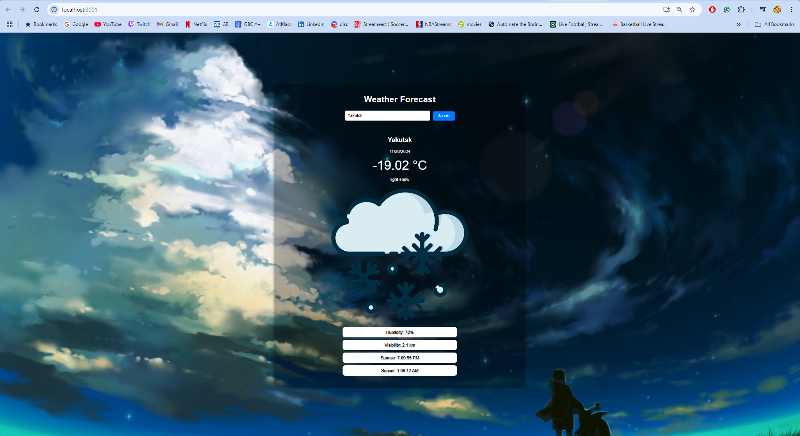
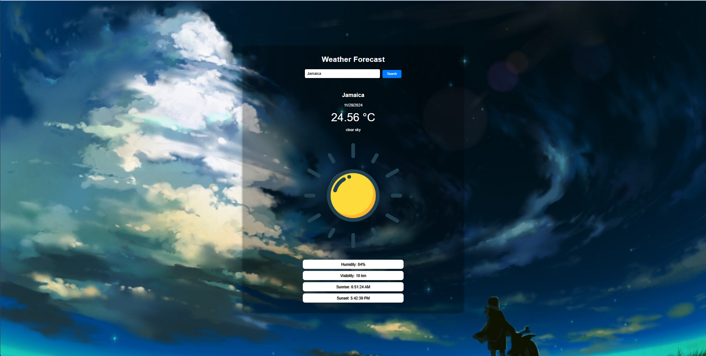
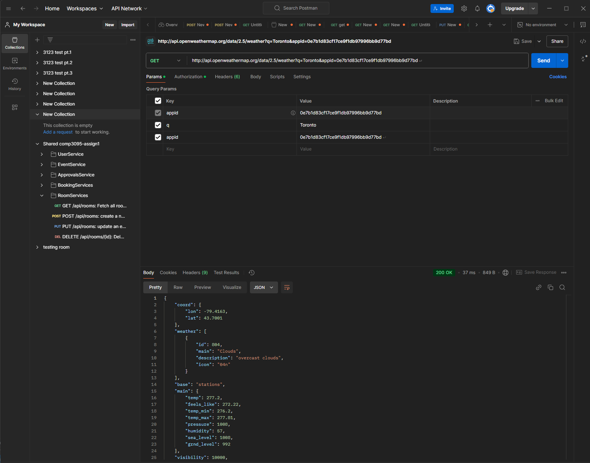

## Student Info 

Daniel De Mesa - Borrett
101440281

# Weather Forecast Application

A simple, user-friendly weather app built using **ReactJS** and the **OpenWeatherMap API**. This project allows users to search for any city and view its current weather conditionss.

## Features

- Search for weather conditions by city.
- Displays the following:
- Temperature (in Celsius).
- Weather description.
- Humidity.
- Visibility.
- Sunrise and sunset times.
- Dynamic weather icons based on conditions (sunny, rainy, cloudy, snowy).

## API Used

This project uses the [OpenWeatherMap API](https://openweathermap.org/) for real-time weather data. API endpoint example:

## Icons && Themes are from 

https://www.wallpaperflare.com/anime-sky-atmosphere-clouds-sun-weather-cloudscape-landscape-wallpaper-ynss/download
    snow: "https://www.flaticon.com/free-icons/frost",
    sun: "https://www.flaticon.com/free-icons/haw-weather",
    rain: "https://www.flaticon.com/free-icons/open-umbrella",
    cloudy: "https://www.flaticon.com/free-icons/halloween-weather",

## Screenshots of Running code & Postman 

## Working Weather App w/ snow&& sun

## PostmanWorking 
    Postman working within applciaiton 

